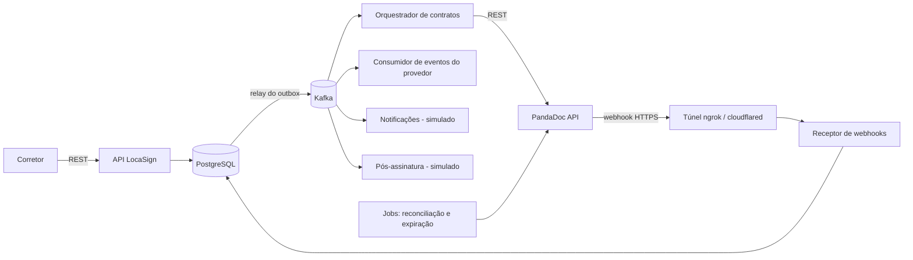
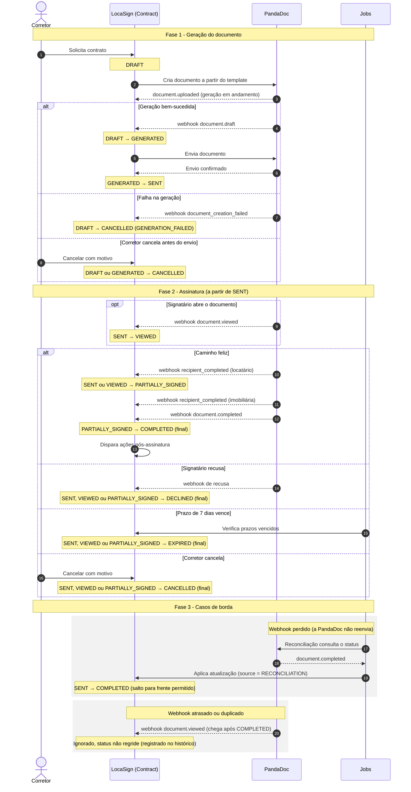
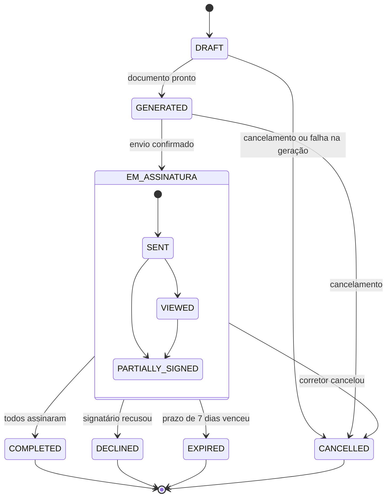
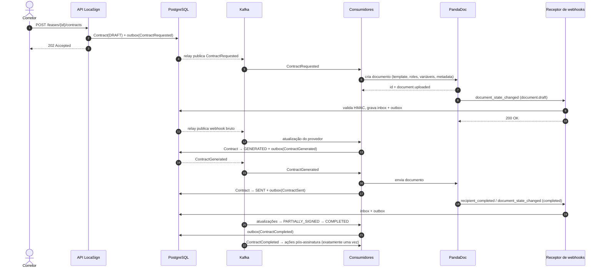

# LocaSign — Guia Técnico e de Arquitetura

> Documento complementar ao `docs/plano-de-negocio.md`. Público: time técnico e agentes de IA.
> Não contém código de implementação: descreve contratos, nomes, regras e decisões para que
> o código seja escrito a partir dele. Versões verificadas em 08/10/2026.
> Itens marcados com **(confirmar)** devem ser checados na documentação oficial antes de implementar.

---

## 0. Como usar este documento

O plano de negócio define **o quê** e **por quê**. Este guia define **como**. Se houver
conflito, as regras de negócio (R1 a R10 do plano) prevalecem e este guia deve ser corrigido.
Toda decisão técnica relevante que mudar algo daqui deve virar um ADR em `docs/adr/`.

---

## 1. Visão geral da solução

O LocaSign é um **monólito modular**: uma única aplicação Spring Boot, organizada em módulos
por subdomínio, cada um seguindo arquitetura hexagonal. Para um projeto de 1 a 3 dias, um único
deployável reduz a complexidade operacional. Mesmo assim, os módulos ficam separados por pacote
e se comunicam por eventos, o que permite extrair serviços no futuro.



### Princípios que guiam todas as decisões

1. **A PandaDoc é a fonte da verdade sobre o documento; o LocaSign é a fonte da verdade sobre o
   contrato.** O agregado `Contract` decide se uma informação externa muda o status.
2. **Nada externo é chamado dentro de uma requisição HTTP do usuário.** Chamadas à PandaDoc
   acontecem em consumidores Kafka, com retentativa e controle de taxa.
3. **Todo evento sai pelo outbox.** O estado e o evento são gravados na mesma transação, e um
   relay publica no Kafka depois.
4. **Todo webhook entra pelo inbox.** O corpo bruto é gravado antes de qualquer processamento.
5. **Tudo é idempotente.** Webhooks duplicados, mensagens Kafka reentregues e reconciliações
   repetidas nunca produzem efeito duplicado.

---

## 2. Stack e versões

| Tecnologia                             | Versão                                                   | Observação                                                                                          |
|----------------------------------------|----------------------------------------------------------|-----------------------------------------------------------------------------------------------------|
| Kotlin                                 | **2.4.20**                                               | Lançado em 07/09/2026.                                                                              |
| JDK                                    | **25 LTS** (Eclipse Temurin)                             | O Spring Boot 4.1 suporta até o Java 25.                                                            |
| Gradle                                 | **9.7.x** (Kotlin DSL + version catalog)                 | Kotlin 2.4.20 é compatível até o Gradle 9.7.0.                                                      |
| Spring Boot                            | **4.1.x** (última patch disponível; 4.1.1 em 20/08/2026) | Sobre Spring Framework 7. O Boot 4.2 (previsto para novembro de 2026) passa a gerenciar Kotlin 2.4. |
| Spring for Apache Kafka                | Gerenciado pelo Boot                                     | —                                                                                                   |
| Spring Data JDBC                       | Gerenciado pelo Boot                                     | Ver ADR-003.                                                                                        |
| Flyway                                 | Gerenciado pelo Boot                                     | Migrations versionadas.                                                                             |
| Jackson                                | Gerenciado pelo Boot (linha 3 no Boot 4)                 | Com módulo Kotlin.                                                                                  |
| PostgreSQL                             | **18** (imagem `postgres:18`)                            | O 19 está em beta, com GA planejado para outubro de 2026; não usar beta.                            |
| Apache Kafka                           | **4.3.1** (imagem `apache/kafka:4.3.1`), modo KRaft      | Sem ZooKeeper desde a versão 4.0.                                                                   |
| Testcontainers, JUnit, MockK, WireMock | Gerenciados pelo Boot quando possível                    | —                                                                                                   |
| springdoc-openapi                      | Linha compatível com o Boot 4**(confirmar)**             | Documentação OpenAPI da API.                                                                        |
| PandaDoc API                           | REST`public/v1`                                          | Autenticação por header`Authorization: API-Key {chave}`.                                            |

### Nota sobre Kotlin 2.4.20 com Spring Boot 4.1

O Boot 4.1 gerencia Kotlin 2.3, com 2.2 como versão mínima. Ao aplicar o plugin Kotlin 2.4.20,
o plugin Gradle do Spring Boot alinha a versão do Kotlin usada no gerenciamento de dependências
com a versão do plugin. A combinação deve funcionar, mas não é a oficialmente gerenciada.
O plano B, se aparecer incompatibilidade, é voltar para Kotlin 2.3.x ou migrar para o Boot 4.2
quando for lançado.

---

## 3. Arquitetura hexagonal aplicada

### 3.1 Regra de dependência

```text
interfaces (driving)  ──►  app  ──►  domain  ◄──  app  ◄──  infra (driven)
```

| Camada       | Pode depender de                                | Nunca pode depender de                                              |
|--------------|-------------------------------------------------|---------------------------------------------------------------------|
| `domain`     | Biblioteca padrão do Kotlin                     | Spring, Jackson, JDBC, Kafka, PandaDoc,`app`, `interfaces`, `infra` |
| `app`        | `domain`                                        | Spring (exceto onde indicado na seção 3.6),`interfaces`, `infra`    |
| `interfaces` | `app`, `domain`                                 | `infra`                                                             |
| `infra`      | `app` (implementa as portas de saída), `domain` | `interfaces`                                                        |

A regra é verificada automaticamente por testes de arquitetura (ArchUnit ou Konsist; ver seção 15).

### 3.2 Correspondência com o diagrama hexagonal

| Parte do diagrama                 | No LocaSign                                                                                 |
|-----------------------------------|---------------------------------------------------------------------------------------------|
| Interface / Driving adapters      | Controllers REST, receptor de webhooks da PandaDoc, consumidores Kafka.                     |
| Core / Domain                     | Agregados`Lease` e `Contract`, value objects, eventos de domínio, política de transições.   |
| Core / Application                | Use cases (commands) e query services (queries).                                            |
| Ports                             | Interfaces em`app/ports/out` (repositórios, provedor de assinatura, publicador de eventos). |
| Infrastructure / Driven adapters  | Persistência (Spring Data JDBC), cliente PandaDoc, outbox e relay para o Kafka.             |
| "Queries can bypass domain layer" | Os endpoints GET usam query ports que leem direto do banco, sem carregar agregados.         |

### 3.3 Adaptações do template Java para Kotlin

| Template (Java)                      | LocaSign (Kotlin)                                                       | Motivo                                                                                               |
|--------------------------------------|-------------------------------------------------------------------------|------------------------------------------------------------------------------------------------------|
| Java Records em DTOs                 | `data class`                                                            | Equivalente idiomático.                                                                              |
| MapStruct                            | Extension functions em`mappers/`                                        | Evita processamento de anotações (kapt), o mapeamento fica explícito e é um bom exercício de Kotlin. |
| Feign (`@FeignClient`)               | HTTP Interface (`@HttpExchange`) sobre `RestClient`                     | O OpenFeign está em modo de manutenção; o HTTP Interface é nativo no Spring Framework 7.             |
| Entidades JPA (`@Entity`)            | Records de persistência do Spring Data JDBC                             | Ver ADR-003.                                                                                         |
| Exceções de domínio                  | Hierarquia selada de erros de domínio, mais exceções onde fizer sentido | `when` exaustivo no mapeamento para HTTP.                                                            |
| `swagger/` com interfaces anotadas   | `interfaces/web/openapi/`                                               | Mantém os controllers limpos.                                                                        |
| Migrations em`infra/config/database` | `src/main/resources/db/migration`                                       | Convenção do Flyway; a configuração do datasource fica em`infra/config/database`.                    |
| Pasta`feign/`                        | Pasta`pandadoc/`                                                        | O adapter tem o nome do sistema externo, não da tecnologia.                                          |

### 3.4 Estrutura de pastas

```text
/ (raiz do repositório)
├── .github/workflows/            # CI: build, testes e testes de arquitetura
├── docs/
│   ├── plano-de-negocio.md
│   ├── arquitetura-tecnica.md    # este documento
│   └── adr/                      # decisões de arquitetura
├── http/                         # requisições de exemplo (.http do IntelliJ) para testes manuais
├── AGENTS.md                     # diretrizes e regras para agentes de IA (ver seção 17)
├── Dockerfile
├── docker-compose.yml
├── .env.example                  # variáveis sem valores secretos
├── build.gradle.kts
├── settings.gradle.kts
├── gradle/libs.versions.toml     # version catalog (fonte única das versões)
└── src/
    ├── main/
    │   ├── kotlin/br/com/locasign/
    │   │   ├── LocaSignApplication.kt
    │   │   ├── shared/                   # transversal e sem regra de negócio
    │   │   │   ├── domain/               # tipos base: identificadores, interface de evento de domínio
    │   │   │   ├── app/                  # portas transversais (Clock, contexto de correlação)
    │   │   │   └── infra/                # outbox, relay, inbox, idempotência de consumidores
    │   │   ├── lease/                    # Módulo: Locação (enxuto no MVP)
    │   │   │   ├── domain/ (models, valueobjects, exceptions, events)
    │   │   │   ├── app/ (usecases, queries, ports/out/repository)
    │   │   │   ├── interfaces/web/ (controllers, dto/request, dto/response, mappers)
    │   │   │   └── infra/persistence/ (entities, repositories, adapters, mappers)
    │   │   ├── contract/                 # Módulo: Contrato (o coração do sistema)
    │   │   │   ├── domain/
    │   │   │   │   ├── models/           # Contract (agregado), Signer
    │   │   │   │   ├── valueobjects/     # ContractId, ProviderDocumentId, Cpf, Money, Email, SigningOrder
    │   │   │   │   ├── exceptions/       # erros de domínio (hierarquia selada)
    │   │   │   │   ├── services/         # política de transições de status
    │   │   │   │   └── events/           # ContractEvent (hierarquia selada)
    │   │   │   ├── app/
    │   │   │   │   ├── usecases/         # 1 classe = 1 intenção (lista na seção 4.5)
    │   │   │   │   ├── queries/          # leituras que dispensam o domínio
    │   │   │   │   └── ports/
    │   │   │   │       ├── in/           # opcional
    │   │   │   │       └── out/
    │   │   │   │           ├── repository/   # ContractRepositoryPort, ContractQueryPort
    │   │   │   │           ├── integration/  # SignatureProviderPort (não conhece "PandaDoc")
    │   │   │   │           └── messaging/    # ContractEventPublisherPort
    │   │   │   ├── interfaces/
    │   │   │   │   ├── web/              # controllers, dto, mappers, advice, openapi
    │   │   │   │   ├── webhook/pandadoc/ # receptor: valida HMAC e grava no inbox
    │   │   │   │   └── messaging/        # consumers, dto, mappers (Kafka → use case)
    │   │   │   └── infra/
    │   │   │       ├── persistence/      # entities, repositories, adapters, mappers
    │   │   │       ├── pandadoc/         # clients, dto/request, dto/response, adapters, mappers, exceptions
    │   │   │       ├── messaging/        # adapter do publicador (escreve no outbox), dto, mappers
    │   │   │       ├── scheduling/       # jobs de reconciliação e expiração
    │   │   │       └── config/           # beans, kafka, database, pandadoc, openapi
    │   │   └── notification/             # Módulo: Notificações (simulado; só registra)
    │   └── resources/
    │       ├── application.yml
    │       ├── application-local.yml
    │       └── db/migration/             # V1__..., V2__...
    └── test/kotlin/br/com/locasign/      # espelha main, mais architecture/ e e2e/
```

### 3.5 Commands e Queries

Os **commands** (POST) passam pelo use case, carregam o agregado, aplicam a regra, persistem e
registram eventos. As **queries** (GET) usam um query port que devolve modelos de leitura
prontos, sem passar pelo agregado, como indicado no diagrama ("queries can bypass domain layer").

### 3.6 Use cases sem framework e transações

Os use cases são classes Kotlin puras, instanciadas em `infra/config/beans`, como no template.
A transação é aplicada por um decorator definido em `infra/config` usando `TransactionTemplate`,
que envolve a execução do use case. Assim a camada `app` fica livre de anotações Spring e
testável com fakes das portas.

---

## 4. Modelo de domínio

### 4.1 Glossário de código

O código usa inglês; o negócio usa português.

| Negócio (PT)                       | Código (EN)                                          |
|------------------------------------|------------------------------------------------------|
| Locação                            | `Lease`                                              |
| Contrato                           | `Contract`                                           |
| Signatário                         | `Signer`                                             |
| Locatário                          | `SignerRole.TENANT`                                  |
| Imobiliária (representa o locador) | `SignerRole.AGENCY`                                  |
| Rascunho                           | `ContractStatus.DRAFT`                               |
| Gerado                             | `GENERATED`                                          |
| Enviado                            | `SENT`                                               |
| Visualizado                        | `VIEWED`                                             |
| Parcialmente assinado              | `PARTIALLY_SIGNED`                                   |
| Concluído                          | `COMPLETED`                                          |
| Recusado                           | `DECLINED`                                           |
| Expirado                           | `EXPIRED`                                            |
| Cancelado                          | `CANCELLED`                                          |
| Provedor de assinatura             | `SignatureProvider` (a PandaDoc é uma implementação) |

### 4.2 Value objects

Os value objects são implementados como `value class` quando têm um único valor.

| Value object            | Regra                                                                                         |
|-------------------------|-----------------------------------------------------------------------------------------------|
| `ContractId`, `LeaseId` | UUID gerado no domínio com`kotlin.uuid.Uuid` (API estável desde o Kotlin 2.4).                |
| `ProviderDocumentId`    | Texto não vazio; identificador do documento no provedor.                                      |
| `Cpf`                   | 11 dígitos com dígitos verificadores válidos; aceita entrada com máscara; exibição mascarada. |
| `Email`                 | Formato válido, normalizado em minúsculas.                                                    |
| `Money`                 | Valor decimal com 2 casas, em BRL, sempre maior que zero para aluguel.                        |
| `LeaseTerm`             | Prazo em meses, de 1 a 120; padrão de 30.                                                     |
| `SigningOrder`          | Inteiro positivo; locatário = 1, imobiliária = 2 (R3).                                        |

### 4.3 Máquina de estados do contrato

Diagrama de sequência. Separei em três blocos (geração, assinatura e casos de borda), e cada transição de status aparece
como nota sobre o contrato. Assim as setas ficam lineares.



Ou como diagrama de estados:



**Refinamento técnico em relação ao plano de negócio.** Como webhooks podem se perder (a
PandaDoc não reenvia), o domínio permite **saltos para frente**. Por exemplo, ir de `SENT`
direto para `COMPLETED` se o webhook intermediário nunca chegou.

A regra é implementada por ordem de progresso:

| Status                       | Ordem | Final? |
|------------------------------|-------|--------|
| DRAFT                        | 0     | Não    |
| GENERATED                    | 1     | Não    |
| SENT                         | 2     | Não    |
| VIEWED                       | 3     | Não    |
| PARTIALLY_SIGNED             | 4     | Não    |
| COMPLETED                    | 5     | Sim    |
| DECLINED, EXPIRED, CANCELLED | —     | Sim    |

Uma transição é aceita se o status atual não é final **e** o destino tem ordem maior ou é um
estado final. Qualquer outra transição é ignorada e registrada no histórico como
`IGNORED_TRANSITION` (R5). Uma transição para o mesmo status é um no-op silencioso.

### 4.4 Eventos de domínio

Os eventos formam a hierarquia selada `ContractEvent`.

| Evento                     | Quando                                                                                               |
|----------------------------|------------------------------------------------------------------------------------------------------|
| `ContractRequested`        | Contrato criado em`DRAFT` a pedido do corretor.                                                      |
| `ContractDocumentCreated`  | O provedor aceitou a criação e devolveu o identificador do documento.                                |
| `ContractGenerated`        | O documento ficou pronto no provedor (`GENERATED`).                                                  |
| `ContractGenerationFailed` | O provedor reportou falha na criação; o contrato vai para`CANCELLED` com motivo `GENERATION_FAILED`. |
| `ContractSent`             | Envio confirmado.                                                                                    |
| `ContractViewed`           | Um signatário abriu o documento.                                                                     |
| `ContractSignerCompleted`  | Um signatário assinou (carrega o papel do signatário).                                               |
| `ContractCompleted`        | Todos assinaram.                                                                                     |
| `ContractDeclined`         | Um signatário recusou.                                                                               |
| `ContractExpired`          | O prazo de 7 dias venceu (R4).                                                                       |
| `ContractCancelled`        | Cancelado pelo corretor ou por falha de geração.                                                     |
| `SignedDocumentArchived`   | O PDF assinado foi baixado e arquivado.                                                              |
| `LeaseActivated`           | A locação foi ativada pela ação pós-assinatura.                                                      |

O agregado acumula os eventos pendentes internamente e expõe uma lista somente leitura. Esse é
um uso natural de **explicit backing fields**, recurso estável no Kotlin 2.4.

### 4.5 Use cases

| Use case                  | Disparado por                                      | Efeito                                                                       |
|---------------------------|----------------------------------------------------|------------------------------------------------------------------------------|
| `RegisterLease`           | `POST /leases`                                     | Cria a locação.                                                              |
| `RequestContract`         | `POST /leases/{id}/contracts`                      | Cria o contrato em`DRAFT` e emite `ContractRequested`.                       |
| `CreateProviderDocument`  | Consumidor de`ContractRequested`                   | Chama o provedor, guarda o id do documento e emite`ContractDocumentCreated`. |
| `SendContract`            | Consumidor de`ContractGenerated`                   | Chama o envio no provedor; transição para`SENT`.                             |
| `ApplyProviderUpdate`     | Consumidor do tópico de webhooks, ou reconciliação | Traduz a atualização externa em transição do agregado.                       |
| `CancelContract`          | `POST /contracts/{id}/cancel`                      | Transição para`CANCELLED`.                                                   |
| `ExpireOverdueContracts`  | Job de expiração                                   | Transição para`EXPIRED`.                                                     |
| `ReconcileContracts`      | Job ou endpoint de reconciliação                   | Consulta o provedor e chama`ApplyProviderUpdate`.                            |
| `RunPostSignatureActions` | Consumidor de`ContractCompleted`                   | Ativa a locação e registra vistoria, cobrança e notificações (simuladas).    |
| `ArchiveSignedDocument`   | Webhook`document_completed_pdf_ready`              | Baixa e arquiva o PDF (só com chave de produção).                            |

### 4.6 Recursos do Kotlin para praticar no domínio

| Recurso                                                           | Onde usar                                                                                                                                               |
|-------------------------------------------------------------------|---------------------------------------------------------------------------------------------------------------------------------------------------------|
| `value class`                                                     | Value objects de valor único.                                                                                                                           |
| `sealed interface` + `when` exaustivo sem `else`                  | Status, eventos e erros de domínio.                                                                                                                     |
| Explicit backing fields (estável no 2.4)                          | Lista de eventos pendentes do agregado.                                                                                                                 |
| Context parameters (estável no 2.4)                               | Passar`Clock` e o contexto de correlação para use cases sem poluir assinaturas. É opcional e não deve ser usado no domínio puro se complicar os testes. |
| `kotlin.uuid.Uuid` (estável no 2.4)                               | Identificadores gerados no domínio.                                                                                                                     |
| `when` compilado com `invokedynamic` (estável no 2.4.20, JVM 21+) | Automático, sem ação necessária.                                                                                                                        |
| `allDistinct` / `allEqual` (experimentais no 2.4.20)              | Apenas em testes; evitar em código de produção.                                                                                                         |

---

## 5. Integração com a PandaDoc

> Para agentes de IA: a PandaDoc publica um índice para agentes em
> `https://developers.pandadoc.com/llms.txt`. Acrescentar `.md` a qualquer página da
> documentação retorna a versão em Markdown. Consulte antes de implementar cada chamada.

### 5.1 Conceitos

| Conceito           | Significado no LocaSign                                                                                                                     |
|--------------------|---------------------------------------------------------------------------------------------------------------------------------------------|
| Template           | Modelo do contrato de locação, criado manualmente no app da PandaDoc.                                                                       |
| Role               | Papel de assinatura no template. Usamos`Locatario` e `Imobiliaria`, e esses nomes devem bater exatamente com o campo `role` enviado na API. |
| Variables (tokens) | Dados do contrato inseridos no texto (nome, CPF, endereço, valor, datas).                                                                   |
| Fields             | Campos preenchidos ou assinados pelos signatários (assinatura, data).                                                                       |
| Metadata           | Pares chave-valor enviados na criação; usamos`contract_id` e `lease_id` para correlacionar os webhooks **(confirmar o formato)**.           |
| Recipient          | Signatário com e-mail, nome, role e ordem de assinatura.                                                                                    |

### 5.2 Preparação da conta (checklist do dia 1)

1. Criar a conta (o plano gratuito inclui chave sandbox e chave de produção).
2. Em Settings → API and Integrations, habilitar API e Webhooks e gerar a chave sandbox.
3. Criar o template com as roles `Locatario` e `Imobiliaria` e as variáveis da seção 5.5.
4. Copiar o UUID do template, que aparece na URL do editor.
5. Cadastrar o webhook apontando para o túnel (seção 6.6), selecionar os eventos e copiar a
   shared key.
6. Usar e-mails do mesmo domínio do remetente para os dois signatários (exigência do sandbox),
   por exemplo com aliases do tipo `seu+locatario@dominio` **(confirmar se aliases funcionam)**.

### 5.3 Endpoints usados

A base é `https://api.pandadoc.com/public/v1`.

| Operação                             | Método e caminho                                              | Observação                                                         |
|--------------------------------------|---------------------------------------------------------------|--------------------------------------------------------------------|
| Criar documento a partir de template | `POST /documents`                                             | Retorna status`document.uploaded`; a criação é assíncrona.         |
| Consultar status                     | `GET /documents/{id}`                                         | Usado na reconciliação e como alternativa ao webhook.              |
| Consultar detalhes                   | `GET /documents/{id}/details`                                 | Recipients e estado de cada signatário.                            |
| Enviar                               | `POST /documents/{id}/send`                                   | Só depois de`document.draft`; aceita mensagem, assunto e `silent`. |
| Baixar documento                     | `GET /documents/{id}/download`                                | —                                                                  |
| Baixar documento protegido           | Endpoint "Download Protected Document"**(confirmar caminho)** | Após`document_completed_pdf_ready`; exige chave de produção.       |

### 5.4 Fluxo de criação, envio e assinatura



### 5.5 Dados enviados na criação

| Variável no template | Origem                   | Formato                                            |
|----------------------|--------------------------|----------------------------------------------------|
| `Locatario.Nome`     | `Lease.tenant.name`      | Texto.                                             |
| `Locatario.CPF`      | `Lease.tenant.cpf`       | `000.000.000-00`.                                  |
| `Imovel.Endereco`    | `Lease.property.address` | Texto.                                             |
| `Aluguel.Valor`      | `Lease.rentAmount`       | `R$ 2.500,00` (formatação pt-BR feita no adapter). |
| `Locacao.Inicio`     | `Lease.startDate`        | `dd/MM/yyyy`.                                      |
| `Locacao.Prazo`      | `Lease.term`             | `30 meses`.                                        |

A formatação é responsabilidade do adapter da PandaDoc. O domínio guarda tipos, não textos
formatados.

### 5.6 Mapeamento PandaDoc → domínio

| Sinal da PandaDoc                                                     | Ação no domínio                                                                      |
|-----------------------------------------------------------------------|--------------------------------------------------------------------------------------|
| Status`document.uploaded`                                             | Nenhuma (geração em andamento).                                                      |
| Status`document.draft`                                                | `DRAFT` → `GENERATED`.                                                               |
| Status`document.sent`                                                 | →`SENT` (no-op se já estiver).                                                       |
| Status`document.viewed`                                               | →`VIEWED`.                                                                           |
| Evento`recipient_completed` (com `recipients[].has_completed`)        | Marca o signatário como concluído; →`PARTIALLY_SIGNED` se ainda faltar alguém.       |
| Status`document.completed`                                            | →`COMPLETED`.                                                                        |
| Status de recusa (provável`document.declined`) **(confirmar o enum)** | →`DECLINED`.                                                                         |
| Status de anulação, ou evento`document_deleted`                       | →`CANCELLED` se fomos nós que pedimos; caso contrário, registrar anomalia e alertar. |
| Evento`document_creation_failed`                                      | →`CANCELLED` com motivo `GENERATION_FAILED`.                                         |
| Evento`document_completed_pdf_ready`                                  | Dispara`ArchiveSignedDocument`.                                                      |
| Qualquer outro evento                                                 | Gravar no inbox e ignorar.                                                           |

### 5.7 Limites e tratamento de erros

| Situação                                                  | Tratamento                                                                                                                                 |
|-----------------------------------------------------------|--------------------------------------------------------------------------------------------------------------------------------------------|
| Limite do sandbox: 10 requisições por minuto por endpoint | Limitador de taxa no adapter (token bucket próprio, configurado com margem em 8/min) mais retentativa com backoff exponencial em HTTP 429. |
| Uso do documento antes de`document.draft`                 | Nunca enviar sem antes ter recebido`GENERATED`. Se ocorrer 404, tratar como "ainda não pronto" e não como "inexistente".                   |
| HTTP 403 por créditos de uso esgotados                    | Parar as retentativas, marcar o contrato com falha de geração e alertar.                                                                   |
| Erros 5xx ou timeout                                      | Retentativa com backoff (o consumidor Kafka reprocessa) e, depois do limite, envio para a DLT.                                             |
| Erro de role no template (ex.: role não informada)        | Chega via`document_creation_failed`; registrar o detalhe do erro no histórico.                                                             |

Timeouts do cliente HTTP: conexão de 5 segundos e leitura de 15 segundos. Os recursos de
resiliência nativos do Spring Framework 7 podem ser usados para retentativas **(confirmar a
API)**.

### 5.8 Porta de saída `SignatureProviderPort`

A porta não menciona a PandaDoc. Operações, em linguagem de domínio:

1. **Criar documento** a partir de um contrato e seus signatários; retorna o
   `ProviderDocumentId`.
2. **Consultar status** de um documento; retorna o status neutro e os signatários concluídos.
3. **Enviar** um documento pronto, com assunto e mensagem.
4. **Baixar o documento assinado**; retorna bytes ou "indisponível" (sandbox ou flag desligada).

O adapter `PandaDocSignatureProviderAdapter` implementa a porta e é o único lugar que conhece
os DTOs, os nomes de status e os endpoints da PandaDoc.

---

## 6. Webhooks

### 6.1 Como a PandaDoc entrega

| Aspecto                   | Comportamento                                                                                    |
|---------------------------|--------------------------------------------------------------------------------------------------|
| Método e formato          | `POST` com JSON. O corpo é um **array** que pode conter vários eventos.                          |
| Cabeçalho de deduplicação | `X-PandaDoc-Webhook-Event-Id` (UUID estável por entrega).                                        |
| Assinatura                | HMAC-SHA256 do corpo bruto em UTF-8, com a shared key, enviado no parâmetro de query`signature`. |
| Timeouts                  | 5 segundos de conexão e 20 segundos de leitura.                                                  |
| Retentativas              | **Nenhuma automática.** Só há reenvio manual pelo Webhooks History do painel.                    |
| Sucesso                   | Qualquer status abaixo de 400 (recomendado 200).                                                 |
| Desativação               | Imediata se respondermos**410**; ou após 7 dias só com falhas.                                   |
| IPs de origem (US)        | 52.12.31.116, 52.37.240.175, 35.167.41.246.                                                      |

### 6.2 Algoritmo do receptor (`POST /webhooks/pandadoc`)

1. Ler o **corpo bruto em bytes** antes de qualquer desserialização. Reserializar o JSON quebra
   a assinatura.
2. Calcular o HMAC-SHA256 em hexadecimal com a shared key e comparar com o parâmetro
   `signature` em **tempo constante**.
3. Se a assinatura for inválida, responder 401 e registrar métrica e log, sem gravar o corpo.
4. Ler o `X-PandaDoc-Webhook-Event-Id`. Se estiver ausente, gerar um id a partir do hash do
   corpo.
5. Na mesma transação, inserir no `webhook_inbox` com conflito ignorado por `delivery_id`. Só se
   a linha for nova, criar uma linha no outbox para o tópico de webhooks para cada item do array,
   com id de mensagem `deliveryId:índice`.
6. Responder **200** em menos de 1 segundo. O processamento real acontece depois, via Kafka.
7. **Nunca** responder 410. Eventos desconhecidos também recebem 200.

### 6.3 Deduplicação e ordem

Há três camadas de proteção:

- O `delivery_id` é único no inbox, o que descarta reentregas manuais.
- A tabela `processed_messages` por grupo de consumidores descarta reentregas do Kafka.
- O próprio agregado ignora transições repetidas ou para trás (R5).

Uma mesma mudança pode gerar **ids diferentes** para tipos de evento diferentes (por exemplo,
`document_updated` e `document_state_changed`). Por isso a idempotência final depende do
agregado.

Para ordem fora de sequência, guardar `provider_last_modified_at` (o `date_modified` do payload)
e descartar atualizações mais antigas que a última aplicada. A chave Kafka do tópico de webhooks
é o id do documento, o que garante ordem por documento dentro da partição.

### 6.4 Reconciliação

Como a PandaDoc não reenvia, um webhook perdido deixaria o contrato parado para sempre. O job de
reconciliação (seção 12) consulta o status dos contratos não finais sem atualização recente e
alimenta o mesmo use case `ApplyProviderUpdate`, com `source = RECONCILIATION`. Esse job também
é o plano B se os webhooks não estiverem disponíveis na conta.

### 6.5 Testes de webhook

Os testes automatizados devem cobrir:

- Assinatura válida e inválida.
- Entrega duplicada.
- Array com vários eventos.
- Eventos fora de ordem.
- `document_creation_failed`.
- Evento desconhecido.

Para testes manuais, gerar payloads assinados localmente com a mesma shared key e usar o botão
Retry do Webhooks History para reenviar eventos reais.

### 6.6 Exposição local

A PandaDoc precisa de uma URL pública com HTTPS. Use ngrok ou Cloudflare Tunnel apontando para
`localhost:8080` e cadastre `https://<tunel>/webhooks/pandadoc` no painel. A documentação mostra
a assinatura chegando como `?signature={signature}` **(confirmar no cadastro se é preciso incluir
o placeholder na URL)**. A URL de túneis gratuitos muda a cada execução, então atualize o
cadastro sempre que reiniciar o túnel.

---

## 7. Kafka

### 7.1 Por que Kafka aqui

O Kafka desacopla três ritmos diferentes: o do usuário (resposta imediata), o da PandaDoc (assíncrono e com limite de
taxa) e o das reações pós-assinatura. Também permite reprocessar,
inspecionar e adicionar novos consumidores sem mexer no fluxo principal.

### 7.2 Tópicos

| Tópico                          | Chave                       | Produzido por                             | Consumido por                                                                | Partições (local) |
|---------------------------------|-----------------------------|-------------------------------------------|------------------------------------------------------------------------------|-------------------|
| `locasign.pandadoc.webhooks.v1` | id do documento na PandaDoc | Relay do outbox (originado no receptor)   | `locasign-provider-events`                                                   | 3                 |
| `locasign.contract.events.v1`   | `contractId`                | Relay do outbox (originado nos use cases) | `locasign-orchestrator`, `locasign-post-signature`, `locasign-notifications` | 3                 |
| `<tópico>.dlt`                  | Igual ao original           | Error handler do Spring Kafka             | Reprocessamento manual                                                       | 1                 |

Fator de replicação 1 no ambiente local. A criação automática de tópicos fica desligada no
broker; os tópicos são declarados pela aplicação.

### 7.3 Envelope das mensagens

| Campo                           | Descrição                                                                |
|---------------------------------|--------------------------------------------------------------------------|
| `eventId`                       | UUID único; é a chave de idempotência dos consumidores.                  |
| `eventType`                     | Nome do evento (ex.:`ContractCompleted`); também vai em header.          |
| `schemaVersion`                 | Começa em 1.                                                             |
| `occurredAt`                    | Instante em UTC (ISO-8601).                                              |
| `aggregateType` / `aggregateId` | Ex.:`Contract` e o id do contrato.                                       |
| `correlationId`                 | Propagado desde a requisição ou webhook de origem.                       |
| `causationId`                   | `eventId` da mensagem que causou esta.                                   |
| `payload`                       | Dados do evento: ids e dados essenciais,**sem CPF ou e-mail completos**. |

Os eventos são serializados em JSON. Não há Schema Registry no MVP (ver ADR-009).

### 7.4 Catálogo de reações

| Evento                                                                                                                                                 | Grupo           | Reação                                            |
|--------------------------------------------------------------------------------------------------------------------------------------------------------|-----------------|---------------------------------------------------|
| `ContractRequested`                                                                                                                                    | orchestrator    | `CreateProviderDocument`.                         |
| `ContractGenerated`                                                                                                                                    | orchestrator    | `SendContract`.                                   |
| Item de webhook                                                                                                                                        | provider-events | `ApplyProviderUpdate` ou `ArchiveSignedDocument`. |
| `ContractCompleted`                                                                                                                                    | post-signature  | `RunPostSignatureActions`.                        |
| `ContractSent`, `ContractSignerCompleted`, `ContractCompleted`, `ContractDeclined`, `ContractExpired`, `ContractCancelled`, `ContractGenerationFailed` | notifications   | Registra a notificação simulada.                  |

### 7.5 Produtor, consumidor e erros

O **produtor** usa idempotência habilitada e `acks=all`, e só é chamado pelo relay do outbox.

O **consumidor** faz commit de offset depois do processamento, verifica e registra o `eventId`
em `processed_messages` na mesma transação do efeito, e usa `DefaultErrorHandler` com backoff
exponencial (3 tentativas). Depois do limite, a mensagem vai para a DLT do tópico via
`DeadLetterPublishingRecoverer`, com o sufixo `.dlt` configurado explicitamente. Erros de
validação não recuperáveis (payload ilegível) vão direto para a DLT, sem retentativa.

Para aprender: o Kafka 4 tornou disponível o novo protocolo de rebalanceamento de consumidores,
habilitado por `group.protocol=consumer` nos consumidores. É opcional.

### 7.6 Outbox relay

1. A cada 1 a 2 segundos, buscar um lote de até 100 eventos com `published_at` nulo, ordenados
   por `created_at`, usando `FOR UPDATE SKIP LOCKED`.
2. Publicar cada evento com a chave definida e aguardar a confirmação do broker.
3. Marcar `published_at`. Em caso de falha, incrementar `attempts`, guardar `last_error` e
   aplicar backoff.

A garantia resultante é "pelo menos uma vez". A idempotência dos consumidores completa o efeito
"exatamente uma vez" de negócio.

---

## 8. PostgreSQL

### 8.1 Convenções

- Tabelas e colunas em `snake_case`, em inglês.
- Instantes em `timestamptz`, sempre em UTC.
- Dinheiro em `numeric(12,2)`.
- Payloads em `jsonb`, exceto o corpo bruto do webhook, guardado como `text` para preservar os
  bytes exatos.
- Status como `text` com `CHECK`, o que facilita evoluir sem migration de tipo enum.
- Chaves primárias `uuid` geradas no domínio.

### 8.2 Tabelas

| Tabela                    | Finalidade                        | Colunas principais                                                                                                                                                   | Restrições                                                                                              |
|---------------------------|-----------------------------------|----------------------------------------------------------------------------------------------------------------------------------------------------------------------|---------------------------------------------------------------------------------------------------------|
| `leases`                  | Locações                          | id, tenant_name, tenant_cpf, tenant_email, agency_signer_name, agency_signer_email, property_address, rent_amount, start_date, term_months, created_at               | CHECK rent_amount > 0; CHECK term_months entre 1 e 120                                                  |
| `contracts`               | Contratos e versões               | id, lease_id, version_number, status, provider_document_id, provider_last_modified_at, expires_at, cancel_reason, row_version, created_at, updated_at                | UNIQUE (lease_id, version_number); UNIQUE provider_document_id; CHECK status; índice único parcial (R1) |
| `contract_signers`        | Signatários                       | id, contract_id, role, name, email, signing_order, completed_at                                                                                                      | UNIQUE (contract_id, role)                                                                              |
| `contract_status_history` | Trilha de auditoria               | id, contract_id, from_status, to_status, outcome (APPLIED, IGNORED_TRANSITION), source (API, WEBHOOK, RECONCILIATION, SCHEDULER), source_event_id, note, occurred_at | Índice por contract_id                                                                                  |
| `webhook_inbox`           | Entregas brutas (R7)              | id, delivery_id, raw_body, received_at                                                                                                                               | UNIQUE delivery_id                                                                                      |
| `outbox_events`           | Eventos a publicar                | id (= eventId), aggregate_type, aggregate_id, event_type, topic, message_key, payload, headers, created_at, published_at, attempts, last_error                       | Índice parcial WHERE published_at IS NULL                                                               |
| `processed_messages`      | Idempotência de consumidores (R6) | consumer_group, event_id, processed_at                                                                                                                               | PK (consumer_group, event_id)                                                                           |
| `post_signature_actions`  | Efeitos pós-assinatura (R6, R8)   | id, contract_id, action_type, status, executed_at, details                                                                                                           | UNIQUE (contract_id, action_type)                                                                       |
| `notifications_log`       | Notificações simuladas            | id, contract_id, event_type, recipient_masked, created_at                                                                                                            | —                                                                                                       |

### 8.3 Regras de negócio garantidas pelo banco

| Regra                                 | Garantia                                                                                              |
|---------------------------------------|-------------------------------------------------------------------------------------------------------|
| R1: um contrato não final por locação | Índice único parcial em`contracts(lease_id)` filtrando status não finais. Uma violação vira HTTP 409. |
| R6: sem efeito duplicado              | PK em`processed_messages` e UNIQUE em `post_signature_actions`.                                       |
| R7: todo evento externo registrado    | `webhook_inbox` gravado antes de responder.                                                           |
| R9: versões preservadas               | `version_number` e histórico; contratos nunca são apagados.                                           |
| Concorrência                          | `row_version` para lock otimista (`@Version` do Spring Data). Em conflito, o consumidor reprocessa.   |

### 8.4 Migrations

Usamos Flyway com arquivos `V{n}__descricao.sql` em `db/migration`. Uma migration aplicada **nunca** é editada;
correções viram nova migration. A V1 cria todas as tabelas do MVP.

---

## 9. API REST do LocaSign

### 9.1 Convenções

- Prefixo `/api/v1` e JSON.
- Erros em **Problem Details (RFC 9457)**.
- Valores monetários como **string decimal** (`"2500.00"`) para evitar ponto flutuante.
- Datas em ISO-8601.
- Header opcional `X-Correlation-Id`, propagado para logs e eventos.
- Operações assíncronas respondem **202** com `Location` do recurso.
- Sem autenticação no MVP (decisão registrada como risco).

### 9.2 Endpoints

| Método | Caminho                                    | Descrição                            | Sucesso        | Erros         |
|--------|--------------------------------------------|--------------------------------------|----------------|---------------|
| POST   | `/api/v1/leases`                           | Cadastra locação                     | 201 + Location | 400, 422      |
| GET    | `/api/v1/leases/{leaseId}`                 | Locação e contrato atual             | 200            | 404           |
| POST   | `/api/v1/leases/{leaseId}/contracts`       | Solicita contrato (nova versão)      | 202 + Location | 404, 409, 422 |
| GET    | `/api/v1/contracts/{contractId}`           | Status, signatários e prazos         | 200            | 404           |
| GET    | `/api/v1/contracts/{contractId}/history`   | Linha do tempo completa              | 200            | 404           |
| POST   | `/api/v1/contracts/{contractId}/cancel`    | Cancela (motivo obrigatório)         | 202            | 404, 409      |
| POST   | `/api/v1/contracts/{contractId}/reconcile` | Força reconciliação (dev e operação) | 202            | 404           |
| POST   | `/webhooks/pandadoc`                       | Receptor de webhooks                 | 200            | 401           |
| GET    | `/actuator/health`                         | Saúde (banco e Kafka)                | 200            | 503           |

### 9.3 Cadastro de locação: campos

| Campo                                      | Tipo           | Regra                                          |
|--------------------------------------------|----------------|------------------------------------------------|
| `tenant.name`                              | Texto          | Obrigatório, de 3 a 120 caracteres.            |
| `tenant.cpf`                               | Texto          | CPF válido, com ou sem máscara.                |
| `tenant.email`                             | E-mail         | No sandbox, mesmo domínio do remetente.        |
| `agencySigner.name` / `agencySigner.email` | Texto / e-mail | Se ausentes, usar o padrão da configuração.    |
| `property.address`                         | Texto          | Obrigatório.                                   |
| `rentAmount`                               | String decimal | Maior que zero, 2 casas.                       |
| `startDate`                                | Data           | Igual ou posterior a hoje (America/Sao_Paulo). |
| `termMonths`                               | Inteiro        | De 1 a 120; padrão 30.                         |

O Kotlin 2.4 estabilizou novas regras padrão de alvo para anotações em parâmetros de construtor.
O primeiro DTO deve ter um teste provando que a Bean Validation realmente dispara.

### 9.4 Mapeamento de erros

| Erro                                                  | HTTP | `type`                             |
|-------------------------------------------------------|------|------------------------------------|
| Entrada malformada ou campo obrigatório ausente       | 400  | `/problems/validation`             |
| Regra de negócio violada (CPF inválido, data passada) | 422  | `/problems/business-rule`          |
| Recurso inexistente                                   | 404  | `/problems/not-found`              |
| Já existe contrato ativo para a locação (R1)          | 409  | `/problems/active-contract-exists` |
| Operação sobre contrato em estado final               | 409  | `/problems/contract-final`         |

O mapeamento fica no `advice` com `when` exaustivo sobre a hierarquia selada de erros de domínio.

---

## 10. Docker e ambiente local

### 10.1 Serviços do `../compose.yml`

| Serviço    | Imagem                                   | Porta | Observação                                                                        |
|------------|------------------------------------------|-------|-----------------------------------------------------------------------------------|
| `postgres` | `postgres:18`                            | 5432  | Volume nomeado; healthcheck com`pg_isready`.                                      |
| `kafka`    | `apache/kafka:4.3.1`                     | 9092  | KRaft em nó único (broker e controller); criação automática de tópicos desligada. |
| `kafka-ui` | Kafka UI do projeto kafbat**(opcional)** | 8081  | Para visualizar tópicos, mensagens e lag.                                         |
| `app`      | Build do`Dockerfile`                     | 8080  | Em profile do Compose, para poder rodar a app pela IDE no dia a dia.              |
| `tunnel`   | ngrok ou cloudflared**(opcional)**       | —     | Em profile separado.                                                              |

Todos os serviços têm healthcheck. A `app` depende de `postgres` e `kafka` saudáveis.

### 10.2 Armadilha clássica: listeners do Kafka

O broker precisa de **dois listeners anunciados**:

- Um para clientes dentro da rede do Compose (ex.: `kafka:29092`), usado pelo container `app`.
- Um para clientes no host (ex.: `localhost:9092`), usado pela app rodando na IDE e pelos
  testes manuais.

Se a app conectar mas não conseguir produzir ou consumir, o problema quase sempre está nos
listeners anunciados.

### 10.3 Diretrizes do `Dockerfile`

1. **Multi-stage:** o estágio de build usa JDK 25 e o wrapper do Gradle; o estágio final usa
   apenas JRE 25.
2. **Camadas:** extrair o jar em camadas com o modo de ferramentas do Spring Boot para
   aproveitar o cache.
3. **Segurança:** rodar como usuário não root.
4. **JVM:** limites de memória por porcentagem do container; virtual threads habilitadas pela
   propriedade `spring.threads.virtual.enabled`.
5. **Healthcheck:** apontando para `/actuator/health`.

### 10.4 Comandos do dia a dia

- `docker compose up -d` sobe a infraestrutura.
- `./gradlew bootRun --args='--spring.profiles.active=local'` roda a app na IDE.
- `./gradlew test` roda todos os testes; os de integração sobem seus próprios containers.
- `docker compose --profile app up -d --build` roda tudo em containers.

---

## 11. Configuração e segredos

| Variável                                     | Exemplo                                     | Uso                                 |
|----------------------------------------------|---------------------------------------------|-------------------------------------|
| `SPRING_PROFILES_ACTIVE`                     | `local`                                     | Profile ativo.                      |
| `DB_URL` / `DB_USERNAME` / `DB_PASSWORD`     | `jdbc:postgresql://localhost:5432/locasign` | Banco.                              |
| `KAFKA_BOOTSTRAP_SERVERS`                    | `localhost:9092`                            | Kafka.                              |
| `PANDADOC_BASE_URL`                          | `https://api.pandadoc.com/public/v1`        | API.                                |
| `PANDADOC_API_KEY`                           | segredo                                     | Header`Authorization: API-Key …`.   |
| `PANDADOC_TEMPLATE_ID`                       | UUID do template                            | Criação de documentos.              |
| `PANDADOC_WEBHOOK_SHARED_KEY`                | segredo                                     | Validação do HMAC.                  |
| `PANDADOC_DOWNLOAD_ENABLED`                  | `false`                                     | `true` só com chave de produção.    |
| `PANDADOC_RATE_LIMIT_PER_MINUTE`             | `8`                                         | Margem abaixo do limite do sandbox. |
| `AGENCY_SIGNER_NAME` / `AGENCY_SIGNER_EMAIL` | —                                           | Signatário padrão da imobiliária.   |
| `CONTRACT_SIGNATURE_DEADLINE_DAYS`           | `7`                                         | R4.                                 |
| `APP_TIMEZONE`                               | `America/Sao_Paulo`                         | Formatação e regras de data.        |

Os segredos ficam apenas em `.env` local, que está no `.gitignore`. O `.env.example` lista as
variáveis sem valores. Nunca registrar chaves em logs.

---

## 12. Jobs agendados

| Job             | Frequência     | O que faz                                                                             | Cuidados                                                          |
|-----------------|----------------|---------------------------------------------------------------------------------------|-------------------------------------------------------------------|
| Relay do outbox | 1 a 2 segundos | Publica eventos pendentes.                                                            | `SKIP LOCKED`, lotes pequenos.                                    |
| Reconciliação   | 5 minutos      | Consulta na PandaDoc os contratos não finais sem atualização há mais de 10 minutos.   | Respeitar o limitador de taxa;`source = RECONCILIATION`.          |
| Expiração       | 15 minutos     | Contratos`SENT`, `VIEWED` ou `PARTIALLY_SIGNED` com prazo vencido vão para `EXPIRED`. | R4. Anular também na PandaDoc é opcional**(confirmar endpoint)**. |
| Lembrete        | Diário         | Lembrete simulado no 3º dia.                                                          | Opcional no MVP.                                                  |
| Limpeza         | Diário         | Remove inbox e outbox já publicados com mais de 30 dias.                              | Opcional.                                                         |

Localmente há uma única instância. Se escalar, usar um lock distribuído (ex.: ShedLock).

---

## 13. Observabilidade

- **Logs estruturados em JSON** (suporte nativo do Spring Boot) com `correlationId`,
  `contractId` e `eventId` no contexto.
- **Métricas Micrometer:**
    - webhooks recebidos, inválidos e duplicados;
    - idade do evento mais antigo não publicado no outbox;
    - lag dos consumidores;
    - latência e quantidade de HTTP 429 na PandaDoc;
    - transições aplicadas e ignoradas.
- **Health** com indicadores de banco e Kafka. Expor no Actuator apenas `health`, `info` e
  `metrics`.

---

## 14. Segurança e LGPD

- O HMAC é obrigatório no webhook, com comparação em tempo constante. A lista de IPs da PandaDoc
  pode ser aplicada no túnel ou proxy (opcional).
- CPF e e-mail aparecem **mascarados** em logs e notificações. Eventos Kafka carregam ids, e os
  consumidores que precisarem de dados pessoais consultam pelo id.
- Dados pessoais nunca aparecem em chaves Kafka, nomes de tópico ou métricas.
- O projeto usa somente dados fictícios (R10).
- A API sem autenticação é aceitável apenas no MVP local; está registrada como risco.

---

## 15. Estratégia de testes

| Nível                | Ferramentas                                                                                       | O que cobre                                                                                                 |
|----------------------|---------------------------------------------------------------------------------------------------|-------------------------------------------------------------------------------------------------------------|
| Domínio              | JUnit, kotlin.test                                                                                | Todas as transições da máquina de estados (testes parametrizados), value objects (CPF, Money), invariantes. |
| Aplicação            | Fakes em memória das portas                                                                       | Use cases, idempotência, emissão de eventos.                                                                |
| Adapter PandaDoc     | WireMock                                                                                          | Criação assíncrona (`uploaded` → `draft`), 404 antes do draft, 429 com retentativa, 403, timeout.           |
| Receptor de webhook  | Teste web do Spring                                                                               | HMAC válido e inválido, duplicado, array múltiplo, evento desconhecido.                                     |
| Persistência e Kafka | Testcontainers (`postgres:18`, `apache/kafka-native:4.3.1`) com conexão automática do Spring Boot | Adapters, outbox, relay, consumidores, DLT.                                                                 |
| Arquitetura          | ArchUnit ou Konsist                                                                               | Regra de dependência da seção 3.1;`domain` sem Spring.                                                      |
| Ponta a ponta        | Arquivos`.http` com o sandbox real                                                                | Roteiro de demonstração do plano de negócio.                                                                |

---

## 16. Roteiro de implementação para agentes de IA

| Fase                            | Entrega                                                                                        | Pronto quando                                                                          |
|---------------------------------|------------------------------------------------------------------------------------------------|----------------------------------------------------------------------------------------|
| 0. Fundação                     | Gradle com version catalog, app vazia, Compose com Postgres e Kafka, Flyway V1                 | `docker compose up -d` funciona, a app sobe e o health mostra banco e Kafka saudáveis. |
| 1. Domínio                      | Value objects, agregado`Contract`, política de transições, eventos                             | Todas as transições da seção 4.3 cobertas por testes.                                  |
| 2. Locação e persistência       | Tabelas, adapters,`POST`/`GET` de leases, Problem Details                                      | Cadastro e consulta funcionando com testes de integração.                              |
| 3. Adapter PandaDoc             | Cliente HTTP Interface, criação, status, envio, limitador de taxa                              | Testes com WireMock verdes e um documento criado de verdade no sandbox.                |
| 4. Webhook e inbox              | Receptor, HMAC, deduplicação, túnel configurado                                                | Um webhook real da PandaDoc gravado no inbox.                                          |
| 5. Outbox, Kafka e consumidores | Relay, tópicos, quatro grupos de consumidores, DLT                                             | Fluxo completo da seção 5.4 rodando ponta a ponta.                                     |
| 6. Jobs e cancelamento          | Reconciliação, expiração, endpoint de cancelamento                                             | Contrato com webhook "perdido" é corrigido pela reconciliação.                         |
| 7. Acabamento                   | Testes de arquitetura, Dockerfile, README com roteiro de execução, teste com chave de produção | Critérios de aceite do plano de negócio atendidos.                                     |

O **corte de hoje** são as fases 0 a 4, mais o mínimo da fase 5: um evento publicado e um
consumidor atualizando o status. Isso bate com o corte mínimo do plano de negócio.

---

## 17. Regras para agentes de IA (conteúdo do `AGENTS.md`)

- Antes de qualquer tarefa, ler `docs/plano-de-negocio.md` e `docs/arquitetura-tecnica.md`.
- Este é um **projeto de estudo de Kotlin**:
    - Antes de gerar arquivos grandes, descrever o plano em poucas linhas.
    - Depois de cada fase, resumir os conceitos de Kotlin, Spring, Kafka ou PostgreSQL usados.
- As versões estão fixadas no version catalog. Não alterar sem um ADR.
- `domain` não importa Spring, Jackson, JDBC, Kafka nem nada da PandaDoc. `app` depende
  apenas de `domain`.
- Todo nome de código segue o glossário da seção 4.1.
- Não usar `!!`. Preferir tipos selados com `when` exaustivo sem `else`.
- Mapeamentos são feitos com extension functions em `mappers/`. Não usar MapStruct.
- Toda mudança de status passa pelo agregado `Contract`. Nunca atualizar o status direto no
  banco.
- Todo evento sai pelo outbox. Use cases nunca publicam direto no Kafka.
- Webhook: validar o HMAC sobre o corpo bruto, gravar no inbox e responder 200. Nunca
  responder 410.
- Antes de implementar uma chamada à PandaDoc, consultar
  `https://developers.pandadoc.com/llms.txt` (acrescentar `.md` às páginas). Itens marcados
  "(confirmar)" neste guia devem ser verificados antes de implementar.
- Cada funcionalidade vem com testes. `./gradlew test` deve passar antes de cada commit.
- Fazer commits pequenos, um por capacidade.
- Nunca registrar em log segredos, nem CPF ou e-mail completos.

---

## 18. Decisões de arquitetura (ADRs iniciais)

| ADR | Decisão                                                   | Motivo                                                                                                            | Alternativa descartada                                           |
|-----|-----------------------------------------------------------|-------------------------------------------------------------------------------------------------------------------|------------------------------------------------------------------|
| 001 | Spring Boot 4.1.x com Kotlin 2.4.20                       | Objetivo de estudo do Kotlin 2.4; a versão mínima 2.2 do Boot dá margem de compatibilidade.                       | Ktor (menos material para hexagonal com Kafka e JDBC em 3 dias). |
| 002 | Monólito modular hexagonal                                | Prazo curto, módulos extraíveis no futuro.                                                                        | Microsserviços.                                                  |
| 003 | Spring Data JDBC                                          | Mais idiomático em Kotlin, sem proxies nem lazy loading; o tutorial oficial de Kotlin do Spring migrou para JDBC. | JPA/Hibernate.                                                   |
| 004 | HTTP Interface +`RestClient`                              | Nativo no Spring Framework 7.                                                                                     | OpenFeign (em manutenção).                                       |
| 005 | Outbox e inbox transacionais                              | Consistência entre banco e Kafka sem transações distribuídas.                                                     | Publicar direto no Kafka.                                        |
| 006 | Webhooks processados via Kafka                            | Resposta rápida à PandaDoc e reprocessamento possível.                                                            | Processar dentro da requisição do webhook.                       |
| 007 | Spring MVC com virtual threads                            | Modelo simples e JDBC bloqueante sem custo de escala; coroutines ficam opcionais.                                 | WebFlux com coroutines.                                          |
| 008 | Mappers com extension functions                           | Explícitos, sem processamento de anotações.                                                                       | MapStruct.                                                       |
| 009 | JSON sem Schema Registry, com tópicos versionados (`.v1`) | Simplicidade no MVP.                                                                                              | Avro com Schema Registry.                                        |
| 010 | Saltos de status para frente permitidos                   | Webhooks podem se perder, e a PandaDoc não reenvia.                                                               | Transições estritamente sequenciais.                             |

---

## 19. Riscos técnicos

| Risco                                                 | Mitigação                                                           |
|-------------------------------------------------------|---------------------------------------------------------------------|
| Kotlin 2.4.20 fora da versão gerenciada pelo Boot 4.1 | Plano B com Kotlin 2.3.x, ou Boot 4.2 em novembro.                  |
| Webhooks indisponíveis na conta                       | A reconciliação cobre como polling.                                 |
| Webhook perdido (sem retentativa)                     | Reconciliação mais reenvio manual pelo painel.                      |
| Limite de 10 requisições por minuto no sandbox        | Limitador de taxa e fila natural pelo Kafka.                        |
| HMAC falhando                                         | Ler bytes brutos antes de qualquer desserialização; teste dedicado. |
| Listeners do Kafka mal configurados                   | Seção 10.2.                                                         |
| Escopo grande para 3 dias                             | Roteiro com corte definido (seção 16).                              |

---

## 20. Referências

- Kotlin 2.4.0: https://kotlinlang.org/docs/whatsnew24.html
- Kotlin 2.4.20: https://kotlinlang.org/docs/whatsnew2420.html
- Requisitos do Spring Boot: https://docs.spring.io/spring-boot/system-requirements.html
- Kotlin no Spring Boot 4: https://spring.io/blog/2025/12/18/next-level-kotlin-support-in-spring-boot-4/
- Downloads do Kafka: https://kafka.apache.org/community/downloads/
- Roadmap do PostgreSQL: https://www.postgresql.org/developer/roadmap/
- PandaDoc (índice para agentes): https://developers.pandadoc.com/llms.txt
- PandaDoc, webhooks: https://developers.pandadoc.com/docs/webhooks
- PandaDoc, referência de eventos: https://developers.pandadoc.com/docs/webhook-events
- PandaDoc, criar documento a partir de template: https://developers.pandadoc.com/docs/create-document-from-template
- PandaDoc, ciclo de vida do documento: https://developers.pandadoc.com/docs/automate-document-workflows
